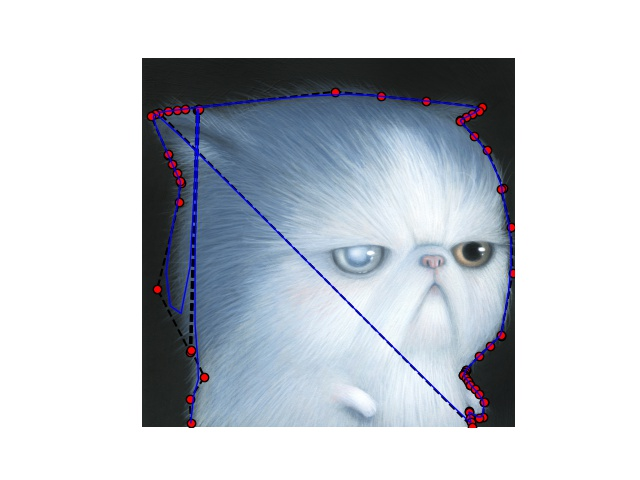

## Spline drawer
### Task

In mathematics, a spline is a special function defined piecewise by polynomials ([read more](https://en.wikipedia.org/wiki/Spline_(mathematics))). <br />
We want you to implement a service to take an image and
tck parameters as inputs and visualize the spline on the image. Implement the mentioned service in Sanic or Flask framework.

<p align="center">

</p>


### Run
```
git clone https://github.com/mo1ein/spline-drawer-danaxa.git
cd spline-drawer-danaxa
pip install -r requirements.txt
python -m flask --reload
```

### API
```
localhost:5000/spline/
```

### Result
As you see in `test.py`, we have tck of points. After process data, you can see splines. :)

<p align="center">

</p>
