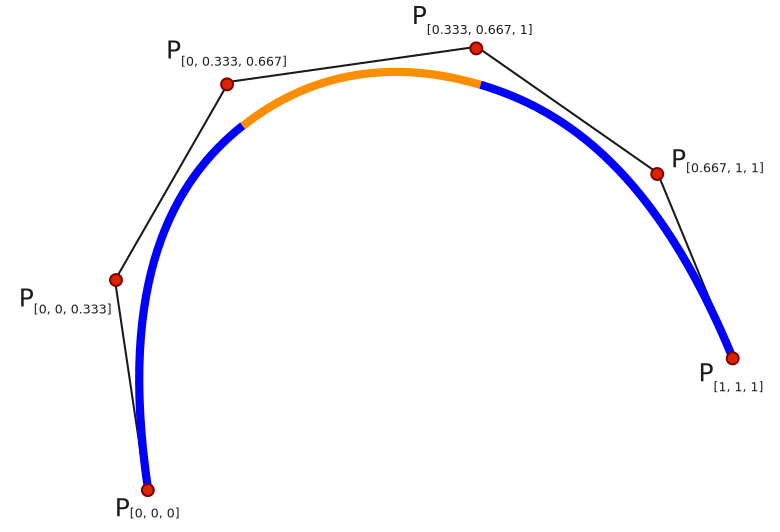

## spline drawer
Draw spline in image with given points.

<center>

</center>

#### run
```
clone github.com/mo1ein/spline-drawer-danaxa/...
cd ...
pip install -r requirements.txt
python -m flask --reload
```

#### api
```
localhost:5000/spline/
```
